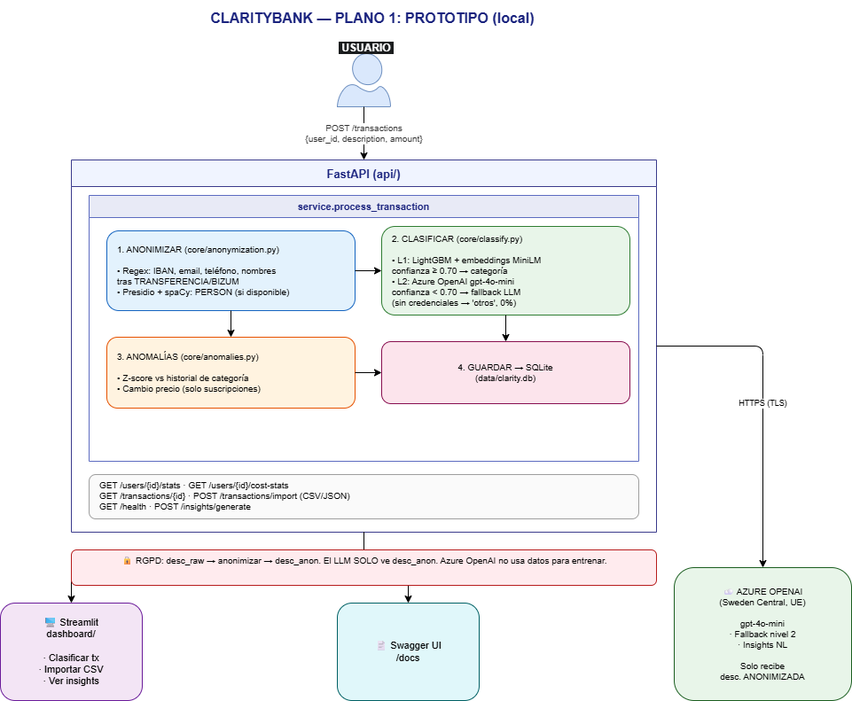
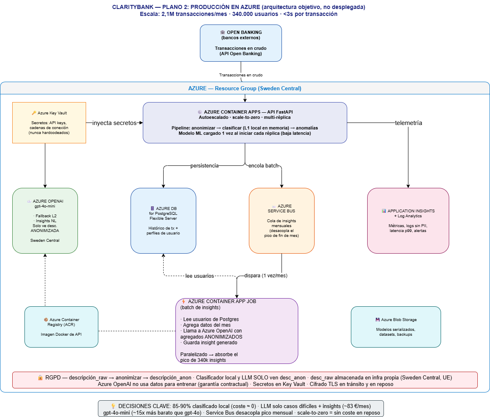
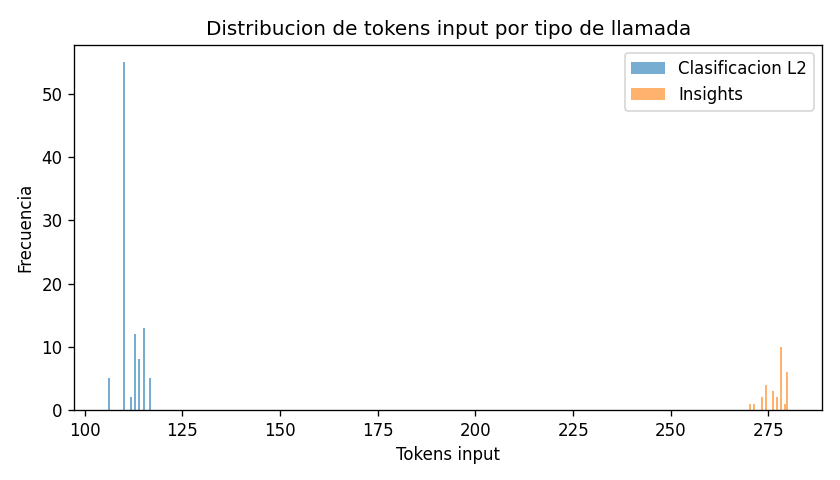
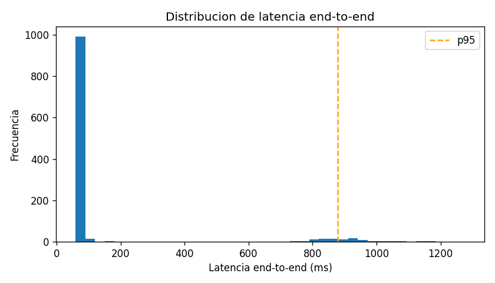
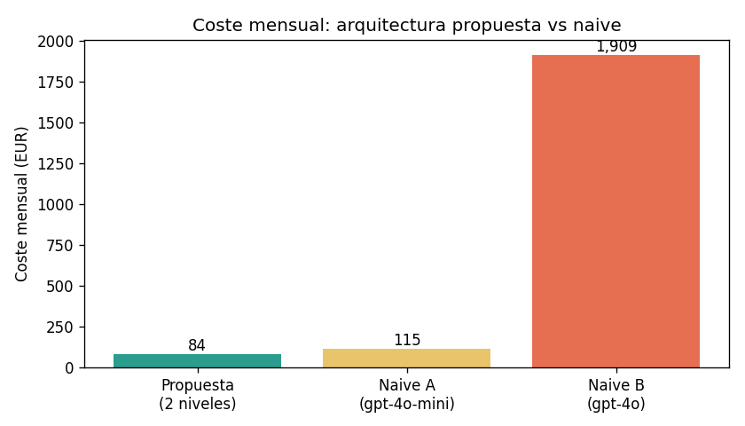

<!--
  GitHub repo README for clarity-bank (Spanish version)
  Repo: github.com/JorgePulgar/clarity-bank
  Place this file as README.es.md at the root of the repo.
-->

<p align="right"><sub><a href="./README.md">English</a> · <b>Español</b></sub></p>

<h1 align="center">ClarityBank — Transaction Intelligence</h1>

<p align="center">
  <b>Pipeline de categorización de transacciones en dos niveles para una fintech española</b> · Backend FastAPI · Dashboard Streamlit<br>
  <sub>LightGBM · Azure OpenAI · Anonimización RGPD con Presidio · Detección de anomalías · Prototipo de proyecto</sub>
</p>

<p align="center">
  
  
  
  
  
</p>

---

Prototipo FastAPI + Streamlit que clasifica descripciones brutas de transacciones bancarias en 12 categorías de gasto mediante un pipeline en dos niveles: primero un clasificador LightGBM local, y como fallback Azure OpenAI `gpt-4o-mini` para los casos con baja confianza — con anonimización RGPD aplicada antes de cualquier llamada externa.

> 🇬🇧 *Also available in English: [README.md](README.md)*

## TL;DR

- **Clasificación en dos niveles**: LightGBM (91,2% de precisión L1, 16,8ms) escala a Azure OpenAI solo cuando la confianza < 0,70 — la precisión combinada L1+L2 alcanza el 96,1%
- Construido con **FastAPI + SQLite + Streamlit + Azure OpenAI + LightGBM + sentence-transformers**
- **Cumplimiento RGPD por diseño**: Presidio + regex elimina nombres, IBANs, DNIs y teléfonos antes de cualquier llamada al LLM — 100% de recall de PII, 0 falsos positivos en tests
- **Detección de anomalías** sobre el histórico de gasto de cada usuario — z-score (σ = 3,0) + detector de cambios en suscripciones — tasa de detección del 1,2% con datos realistas
- **Insights mensuales en lenguaje natural** via `gpt-4o-mini` con fallback determinista por plantilla — la demo funciona sin credenciales cloud
- Prototipo de proyecto para **ClarityBank**, agregador fintech español (340K usuarios, 2,1M transacciones/mes)

## Resumen del proyecto

ClarityBank es un prototipo de proyecto de asignatura de máster para un agregador de banca abierta español. El sistema recibe descripciones brutas de transacciones bancarias junto con sus importes, y asigna automáticamente cada transacción a una de 12 categorías de gasto fijas. Además de clasificar, detecta anomalías de gasto comparando contra el histórico de cada usuario y genera resúmenes financieros mensuales en lenguaje natural.

El proyecto está dividido en dos partes: mi compañera entrenó el clasificador ML (LightGBM + embeddings multilingüe). Yo construí la infraestructura: API REST, persistencia SQLite, pipeline de anonimización RGPD, motor de detección de anomalías, generación de insights con fallback al LLM y el dashboard Streamlit. La interfaz del clasificador es una única función `load()` — hasta que se entregó el modelo, un mock basado en keywords funcionó de forma transparente en su lugar.

## Tabla de contenidos

- [Características principales](#características-principales)
- [Stack tecnológico](#stack-tecnológico)
- [Instalación local](#instalación-local)
- [Estructura del proyecto](#estructura-del-proyecto)
- [Qué hace el sistema](#qué-hace-el-sistema)
- [Por qué importa](#por-qué-importa)
- [Arquitectura](#arquitectura)
- [Estadísticas](#estadísticas)
- [Coste y latencia medidos (benchmark)](#coste-y-latencia-medidos-benchmark)
- [Decisiones de diseño clave](#decisiones-de-diseño-clave)
- [Cómo se cumplen las garantías principales](#cómo-se-cumplen-las-garantías-principales)
- [Limitaciones conocidas](#limitaciones-conocidas)
- [Proceso de desarrollo y lecciones aprendidas](#proceso-de-desarrollo-y-lecciones-aprendidas)
- [Documentación técnica](#documentación-técnica)

---

## Características principales

- **Clasificación en dos niveles**: el clasificador L1 (LightGBM + embeddings multilingüe de 384 dimensiones) funciona en local en ~16,8ms; L2 (Azure OpenAI) solo se activa cuando la confianza L1 < 0,70
- **Anonimización RGPD**: Presidio NER + regex elimina PII antes de cualquier llamada externa; degrada a regex puro si `spacy` no está instalado — la API arranca en cualquier caso
- **Detección de anomalías**: z-score por categoría de gasto (σ = 3,0, mínimo 10 muestras) + detector dedicado de cambios en suscripciones; 4 anomalías en 329 transacciones de prueba (1,2%)
- **Generación de insights**: resúmenes mensuales en lenguaje natural via `gpt-4o-mini`, con fallback determinista por plantilla cuando no hay credenciales Azure configuradas
- **Clasificador sustituible por mock**: `models/load_classifier.py::load()` lanza `NotImplementedError`; `core/classify.py` lo captura y cae al matching por keywords — `GET /health` informa del modo activo
- **55 tests, 0 fallidos**: endpoints API, anonimización, detección de anomalías e insights testados de forma independiente

---

## Stack tecnológico

### Backend

- **Python 3.11+** — probado localmente en 3.14; Presidio/spacy degradan de forma controlada en 3.14 (ver [Limitaciones conocidas](#limitaciones-conocidas))
- **FastAPI >= 0.110** — framework REST asíncrono, validación Pydantic v2, documentación OpenAPI automática en `/docs`
- **SQLite** (Python `sqlite3`) — persistencia en fichero único, sin necesidad de herramientas de migración a escala de prototipo
- **pydantic-settings >= 2.2** — configuración centralizada en `api/config.py`, lee `.env`

### AI / ML

- **LightGBM >= 4.0** — clasificador L1, entrenado con 2.946 transacciones (split 80/10/10); 97,6% de precisión en validación
- **sentence-transformers >= 2.7** — `paraphrase-multilingual-MiniLM-L12-v2`, embeddings multilingüe de 384 dimensiones
- **Azure OpenAI `gpt-4o-mini`** — fallback de clasificación L2 + generación de insights mensuales (desplegado en Sweden Central por cumplimiento RGPD)
- **Presidio Analyzer + Anonymizer >= 2.2** — detección y enmascaramiento de PII basado en NER
- **spacy `es_core_news_md`** — modelo NER en español para Presidio (opcional)

### Dashboard

- **Streamlit >= 1.33** — demo interactiva con feed de transacciones en directo, resaltado de anomalías y vista de insight mensual
- **pandas >= 2.2** — manipulación de datos para tablas y gráficos de Streamlit

### Testing

- **pytest >= 8.1**
- **httpx >= 0.27** — `TestClient` de FastAPI

---

## Instalación local

### Requisitos

- Python 3.11 o 3.12 recomendado (3.14 funciona pero Presidio NER degrada — ver [Limitaciones conocidas](#limitaciones-conocidas))
- Despliegue de Azure OpenAI con `gpt-4o-mini` en Sweden Central — **opcional**, el sistema funciona completamente sin él

### Instalar

```bash
git clone https://github.com/JorgePulgar/clarity-bank.git
cd clarity-bank
python -m venv .venv
source .venv/bin/activate   # Windows: .venv\Scripts\activate
pip install -r requirements.txt
```

Para anonimización NER completa (requiere Python 3.11/3.12):

```bash
python -m spacy download es_core_news_md
```

### Configurar

```bash
cp .env.example .env
# Editar .env — los valores por defecto funcionan para una ejecución local sin Azure.
# Rellenar AZURE_OPENAI_* para activar la clasificación LLM y los insights.
```

Variables clave en `.env.example`:

```env
CLARITY_DB_PATH=data/clarity.db
CLARITY_API_URL=http://127.0.0.1:8000

# Azure OpenAI — dejar vacío para usar fallback por plantilla y clasificador mock
AZURE_OPENAI_ENDPOINT=
AZURE_OPENAI_API_KEY=
AZURE_OPENAI_DEPLOYMENT=gpt-4o-mini
AZURE_OPENAI_REGION=swedencentral

# Forzar clasificador mock aunque exista models/classifier.pkl
USE_MOCK_CLASSIFIER=false

# Modelo spacy para Presidio NER
PRESIDIO_SPACY_MODEL=es_core_news_md
```

### Ejecutar

```bash
# Terminal 1 — API
uvicorn api.main:app --reload

# Terminal 2 — Dashboard
streamlit run dashboard/streamlit_app.py
```

En Windows, doble clic en `start_demo.bat` — instala dependencias, arranca ambos servicios en ventanas separadas, espera al health check y abre el navegador.

La API funciona en `http://localhost:8000` (documentación OpenAPI en `/docs`). El dashboard abre en `http://localhost:8501`.

---

## Estructura del proyecto

```
clarity-bank/
├── api/
│   ├── config.py              # pydantic-settings, lee .env
│   ├── main.py                # App FastAPI, CORS, registro de routers
│   ├── service.py             # Pipeline: anonimizar → clasificar → detectar → persistir
│   ├── db/
│   │   ├── database.py        # Conexión SQLite
│   │   └── queries.py         # Operaciones CRUD
│   ├── models/
│   │   └── schemas.py         # Schemas Pydantic de request/response
│   └── routers/
│       ├── transactions.py    # POST /transactions, POST /transactions/import, GET /transactions
│       ├── insights.py        # GET /insights/{user_id}
│       └── users.py           # GET/POST /users
├── core/
│   ├── anonymization.py       # Presidio NER + regex, degradable
│   ├── classify.py            # Wrapper L1/L2, fallback a mock
│   ├── anomalies.py           # Z-score + detección de cambios en suscripciones
│   └── insights.py            # Azure OpenAI + fallback por plantilla
├── models/
│   ├── load_classifier.py     # Interfaz del clasificador (load() → callable)
│   ├── classifier.pkl         # Modelo LightGBM (joblib)
│   └── model_metadata.json    # Métricas, umbral, info de embeddings
├── dashboard/
│   └── streamlit_app.py       # UI de la demo Streamlit
├── scripts/
│   ├── generate_history.py    # Genera historial sintético de transacciones
│   ├── benchmark.py           # Benchmark empírico de coste y latencia (usage real de Azure)
│   └── e2e_demo.py            # Prueba de humo end-to-end
├── tests/
│   ├── conftest.py
│   ├── test_api.py
│   ├── test_anomalies.py
│   ├── test_anonymization.py
│   └── test_insights.py
├── fases/                     # Planes de fase y progreso de desarrollo
├── docs/
│   ├── claritybank_prototipo.drawio.png
│   ├── claritybank_produccion.drawio.png
│   └── *.png                  # Figuras del benchmark (tokens, latencia, coste)
├── reports/
│   └── benchmark_<timestamp>.json  # Mediciones crudas del benchmark
├── data/
│   └── clarity.db             # Base de datos SQLite (en .gitignore)
├── start_demo.bat             # Arranque con un clic (Windows)
├── start_demo.ps1             # Equivalente PowerShell
├── requirements.txt
└── .env.example
```

---

## Qué hace el sistema

- **Clasifica transacciones** — `POST /transactions` recibe una descripción bruta (p.ej. `PAGO TARJETA MERCADONA SL MADRID`) y un importe, ejecuta el pipeline completo y devuelve `{ "categoria": "alimentacion", "confianza": 1.0, "nivel_usado": 1 }`. La descripción anonimizada y todos los metadatos se persisten en SQLite.
- **Importación masiva** — `POST /transactions/import` acepta un array JSON; cada transacción pasa por el mismo pipeline de forma independiente. Lo usa `scripts/generate_history.py` para inicializar un historial de usuario realista.
- **Detecta anomalías** — cada nueva transacción se compara con el historial de gasto del usuario en esa misma categoría. Si el z-score supera 3,0 (y el usuario tiene al menos 10 muestras previas), la transacción se marca con una descripción de la razón. Las transacciones de suscripciones comprueban adicionalmente si el importe ha cambiado a nivel de comercio.
- **Genera insights mensuales** — `GET /insights/{user_id}` envía las transacciones de los últimos 30 días del usuario a `gpt-4o-mini` y devuelve un resumen en lenguaje natural de 4 párrafos: categorías con más gasto, anomalías detectadas, balance ingresos/gastos y una recomendación accionable. Si no hay credenciales Azure, cae a una plantilla determinista.
- **Expone el estado del sistema** — `GET /health` devuelve `{ "classifier": "real" | "mock", "llm": "configured" | "not configured", "anonymiser": "presidio+regex" | "regex_only" }`.

[↑ Volver al inicio](#tabla-de-contenidos)

---

## Por qué importa

### El problema

Un agregador de banca abierta español procesa 2,1 millones de transacciones al mes de 340.000 usuarios. Cada transacción bruta llega como una cadena formateada por el banco — `COMPRA TPV 12345 MERCADONA SL MADRID` o `RECIBO ENDESA CONTRATO 87654321` — sin categoría asignada. Clasificar manualmente no escala. Enviar los 2,1M de descripciones directamente a un LLM cloud costaría cientos de euros al mes para algo que en su mayoría es un problema resuelto, e introduciría 500–1.500ms de latencia por transacción. Ninguna de las dos opciones es viable.

### Quién tiene este problema

Equipos de PFM (Personal Finance Management) en agregadores de banca abierta, neobancos y cualquier fintech que procese transacciones multi-origen a escala. En el mercado español: Fintonic, Plum y las capas PFM dentro de los grandes bancos.

### Por qué enviar todo a un LLM cloud no es suficiente

Tres razones. Primera, coste: a 2,1M de transacciones/mes y precios de `gpt-4o-mini`, la clasificación LLM completa supone cientos de euros al mes para transacciones que se clasifican de forma trivial. Segunda, latencia: los round-trips al LLM añaden 500–1.500ms; el objetivo de la API es < 3s totales. Tercera, RGPD: las descripciones brutas contienen nombres, IBANs, teléfonos — no pueden salir de la infraestructura de la UE sin anonimizar.

### Cómo lo aborda este proyecto

- **Coste** → el clasificador L1 gestiona > 91% de las transacciones en local a coste cero; el LLM solo se llama para los casos inciertos (confianza < 0,70).
- **Latencia** → el pipeline L1 completa en ~55ms a nivel de API (16,8ms el clasificador puro). L2 añade 500–1.500ms solo para la minoría que lo necesita.
- **RGPD** → `core/anonymization.py` se ejecuta antes de cualquier llamada externa. El LLM recibe `TRANSFERENCIA DE <PERSONA>`, no `TRANSFERENCIA DE JUAN GARCÍA`.

### Casos de uso concretos

Un usuario recibe su nómina: `NOMINA MAYO 2026 EMPRESA SL`. El clasificador asigna `ingresos` con confianza 1,0 en 16,8ms. Un segundo usuario hace una compra de 1.450 EUR en Amazon — 40 veces su importe habitual con ese comercio — el detector de anomalías la marca y el insight mensual la nombra explícitamente: "1.450 EUR en compras, 40 veces superior a la media." La transacción `APPLE` de un tercer usuario tiene confianza 0,36 (por debajo de 0,70): el LLM la resuelve como `suscripciones`. Sin intervención manual en ningún paso.

### Qué no es

No es un sistema bancario de nivel producción — no hay autenticación, ni aislamiento por filas entre usuarios, y SQLite no soporta escrituras concurrentes a escala de agregador. No sustituye la revisión humana para transacciones genuinamente ambiguas. No es un conector multi-banco ni un normalizador de datos — procesa las descripciones que se envíen al endpoint.

[↑ Volver al inicio](#tabla-de-contenidos)

---

## Arquitectura

El prototipo es un despliegue en un único host: backend FastAPI + SQLite + Streamlit en la misma máquina, llamando a Azure OpenAI solo para la clasificación L2 incierta y la generación de insights mensuales.

### Arquitectura del prototipo



### Arquitectura de producción

En un despliegue de producción, la demo Streamlit se sustituye por un frontend propio, SQLite por PostgreSQL y la ingesta de transacciones por un consumidor Kafka en tiempo real. Las capas de API e inferencia ML escalan horizontalmente; el pipeline de anonimización y clasificación permanece igual.



### Componentes

| Capa | Tecnología | Rol |
|------|-----------|-----|
| API | FastAPI + uvicorn | Endpoints REST, validación de requests, CORS |
| Persistencia | SQLite (`sqlite3`) | Usuarios, transacciones, clasificaciones, flags de anomalía |
| Configuración | pydantic-settings | Lectura centralizada de `.env`, validada al arranque |
| Anonimización | Presidio + regex | Eliminación de PII antes de cualquier llamada externa |
| Clasificación L1 | LightGBM + sentence-transformers | Inferencia local, ~16,8ms |
| Clasificación L2 | Azure OpenAI `gpt-4o-mini` | Fallback para confianza < 0,70 |
| Detección de anomalías | Z-score + detector de suscripciones | Comparación contra histórico por usuario |
| Generación de insights | Azure OpenAI `gpt-4o-mini` | Resúmenes mensuales en NL, fallback por plantilla |
| Dashboard | Streamlit | UI de la demo interactiva |

### Flujo de procesamiento de una transacción

1. `POST /transactions` llega a `api/routers/transactions.py`
2. `api/service.py::process_transaction()` toma el control — función única para los endpoints de transacción individual y masiva
3. `core/anonymization.py::anonymize()` — Presidio NER + regex elimina PII; devuelve el texto anonimizado y la lista de tipos de entidad detectados
4. `core/classify.py::classify()` — llama a L1 (LightGBM + embeddings); si confianza < 0,70, llama a L2 (`gpt-4o-mini`); devuelve `{ categoria, confianza, nivel_usado }`
5. `core/anomalies.py::detect_zscore_anomaly()` — z-score contra el histórico de gasto del usuario en esa categoría (mínimo 10 muestras)
6. Si `categoria == "suscripciones"` y no está ya marcada: `detect_subscription_change()` comprueba el historial de pagos a nivel de comercio para detectar desviaciones de precio
7. `api/db/queries.py` inserta la fila completa en SQLite

[↑ Volver al inicio](#tabla-de-contenidos)

---

## Estadísticas

| Métrica | Valor |
|---------|-------|
| Commits totales | 35 |
| LOC Python | 3.479 |
| Ficheros de test | 4 |
| Tests | **55 pasados, 0 fallidos** |
| Precisión L1 (umbral 0,70, set de test) | 91,2% |
| Precisión combinada L1 + L2 | 96,1% |
| F1-macro (L1, set de test) | 91,3% |
| Latencia clasificador L1 — media | 16,8ms |
| Latencia clasificador L1 — p95 | 37ms |
| Latencia pipeline API — media | 55,5ms |
| Latencia pipeline API — p95 | 105,9ms |
| Recall de anonimización PII | 100% (5/5 casos de test) |
| Falsos positivos de anonimización | 0 |
| Tasa de anomalías (329 transacciones, params ajustados) | 1,2% (4 marcadas) |
| Fases de desarrollo completadas | 5 / 6 |

[↑ Volver al inicio](#tabla-de-contenidos)

---

## Coste y latencia medidos (benchmark)

Las cifras de coste y latencia de abajo están **medidas, no estimadas**. `scripts/benchmark.py` ejecuta el pipeline completo sobre 1.200 transacciones, hace 100 llamadas reales de clasificación L2 y 30 de insights a Azure OpenAI, y lee el número exacto de tokens facturados del campo `response.usage` (no una aproximación con `tiktoken`). Los tiempos vienen de `time.perf_counter()`. La ejecución es determinista (`seed=42`); se descartan 2–3 llamadas de warmup antes de medir.

Ejecútalo tú mismo:

```bash
python scripts/benchmark.py                       # defaults: 1.200 tx · 100 L2 · 30 insights
python scripts/benchmark.py --n-classifications 100 --n-insights 30 --pool-size 1200
```

Genera un informe en consola, un JSON con los datos crudos en `reports/benchmark_<timestamp>.json` y las tres figuras de abajo. Coste total de una ejecución del benchmark: **130 llamadas al LLM ≈ 0,0086 €**.

### Coste en tokens del LLM (Azure `gpt-4o-mini`, Sweden Central)

| Tipo de llamada | Tokens input (media / p95 / max) | Tokens output (media / p95) | Coste por llamada |
|-----------------|----------------------------------|-----------------------------|-------------------|
| Clasificación L2 (N=100) | 112 / 115 / 117 | 3 / 4 | **0,0000171 €** (USD 0,0000186) |
| Insight mensual (N=30) | 277 / 280 / 280 | 350 / 372 | **0,000231 €** (USD 0,0002514) |



### Tasa de escalado (L1 vs L2)

| | Recuento | Porcentaje |
|--|---------:|-----------:|
| Resueltas en L1 (local, gratis) | 1.010 | 84,2% |
| Escaladas a L2 (LLM) | 190 | 15,8% |

Categorías que más escalan: `otros` (116), `compras` (37), `restauracion` (37).

> **Nota:** el pool de 1.200 transacciones incluye 100 transacciones deliberadamente ambiguas inyectadas para garantizar una muestra ≥100 para medir tokens de L2. La tasa de escalado **natural** sobre datos sintéticos realistas sola es del ~8%, consistente con el >91% de L1 de [Estadísticas](#estadísticas). La proyección de coste de abajo usa el 15,8% medido, así que es una **cota superior conservadora** — el coste real es menor.

### Latencia end-to-end por componente (máquina de desarrollo, pipeline completo)

| Componente | Media | p95 |
|------------|------:|----:|
| Anonimización | 13,5ms | 16,5ms |
| Clasificación L1 (embedding + LightGBM) | 45,3ms | 56,8ms |
| Clasificación L2 (LLM, solo cuando aplica) | 803ms | 1.010ms |
| Detección de anomalías | 5,9ms | 7,2ms |
| Guardado en BD | 10,4ms | 48,2ms |
| **TOTAL — solo L1** | **72,2ms** | **85,0ms** |
| **TOTAL — escaladas (con L2)** | **913ms** | **1.145ms** |
| **TOTAL — combinado** | 148ms (mediana 72ms) | **879ms** (p99 1.055ms) |



### Proyección a escala ClarityBank (2,1M tx/mes · 340K usuarios)

| | Mensual | Anual |
|--|--------:|------:|
| Clasificación L2 (332.500 llamadas/mes) | 5,69 € | 68,25 € |
| Insights (340.000/mes) | 78,64 € | 943,66 € |
| **Total LLM** | **84,33 €** | **1.011,91 €** |

Coste por usuario/mes: **0,000248 €**.

### Comparación vs naive (enviar todo al LLM)

| Escenario | Coste mensual | Ahorro vs propuesta |
|-----------|--------------:|--------------------:|
| **Propuesta (dos niveles)** | **84,33 €** | — |
| A — todo a `gpt-4o-mini` | 114,56 € | **26,4%** |
| B — todo a `gpt-4o` (modelo grande) | 1.909,36 € | **95,6%** |



**Dos palancas de coste, medidas.** La arquitectura ahorra dinero en dos ejes independientes:

1. **Elección de modelo — `gpt-4o-mini` en vez de `gpt-4o`.** Para exactamente el mismo volumen de tokens, `gpt-4o-mini` es **~94% más barato** por llamada (escenario A 114,56 € vs escenario B 1.909,36 €). Usar el modelo pequeño es la mayor decisión de coste del proyecto.
2. **Enrutado en dos niveles — no enviar todo al LLM.** El clasificador L1 local resuelve ~84% de las transacciones a coste marginal cero, así que solo la minoría incierta llega al LLM. Esto baja la factura de 114,56 € (todo a `gpt-4o-mini`) hasta **84,33 €/mes**.

Combinadas, el diseño de dos niveles + `gpt-4o-mini` cuesta **84,33 €/mes frente a 1.909,36 €/mes** del enfoque naive "todo a `gpt-4o`" — una **reducción del 95,6%**, a **0,000248 € por usuario/mes**. Cifras proyectadas a partir de costes por llamada medidos, no estimados.

### Latencia vs el requisito <3s

| Métrica | Valor | Veredicto |
|---------|------:|:---------:|
| p95 end-to-end combinado | 879ms | ✅ dentro de 3s |
| p99 end-to-end combinado | 1.055ms | ✅ dentro de 3s |
| Margen sobre 3s | 70,7% | — |

Los insights se generan como un lote mensual y no están sujetos al objetivo de <3s por transacción.

[↑ Volver al inicio](#tabla-de-contenidos)

---

## Decisiones de diseño clave

### 1. Cascada en dos niveles — ML local primero, LLM solo para los casos difíciles

**Decisión:** cada transacción la clasifica primero el modelo L1 local (embeddings de sentence-transformer + LightGBM). El LLM de Azure OpenAI (L2) se llama **solo** cuando la confianza de L1 cae por debajo del umbral.

**Alternativa considerada:** enviar cada transacción directamente al LLM — un solo camino de código, sin modelo local que entrenar, distribuir ni cargar.

**Justificación:** la inferencia local tiene **coste marginal cero**. Una vez cargado el modelo, clasificar una transacción cuesta milisegundos de CPU, no euros — el machine learning no factura por llamada, el LLM sí. El benchmark confirma que ~84% de las transacciones se resuelven en L1, así que el LLM se paga solo para la minoría incierta. Esto mantiene la precisión combinada L1+L2 en el 96,1% mientras recorta la factura mensual proyectada de 1.909 € (todo a `gpt-4o`) a 84 € (ver [Coste y latencia medidos](#coste-y-latencia-medidos-benchmark)). La cascada es el núcleo de todo el diseño: el modelo de ML lleva el volumen gratis, el LLM lleva solo la dificultad.

### 2. Pipeline único en `api/service.py`

**Decisión:** una función `process_transaction()` llamada tanto por `POST /transactions` (individual) como por `POST /transactions/import` (masivo).

**Alternativa considerada:** duplicar la lógica del pipeline dentro de cada router.

**Justificación:** dos puntos de entrada que hacen lo mismo acabarán divergiendo. Una función es un sitio para leer, un sitio para testear, un sitio para cambiar.

### 3. Anonimizar antes de clasificar, no solo antes del LLM

**Decisión:** `anonymize()` es el paso 1 del pipeline — antes de que corra el clasificador L1.

**Alternativa considerada:** eliminar PII solo del prompt L2, dejando que L1 vea el texto bruto.

**Justificación:** dos razones. Primera, `description_anonymized` es lo que persiste en SQLite — nunca almacenamos PII en reposo. Segunda, los datos de entrenamiento incluían tokens anonimizados (`<PERSONA>`, `<IBAN>`), así que el clasificador ya está calibrado para manejar texto enmascarado. El orden garantiza el cumplimiento RGPD de forma estructural, no por convención.

### 4. Clasificador sustituible por mock via `NotImplementedError`

**Decisión:** `models/load_classifier.py::load()` lanza `NotImplementedError`; `core/classify.py` captura esa excepción y cae al matching por keywords.

**Alternativa considerada:** una variable de entorno `USE_MOCK_CLASSIFIER` comprobada en `classify.py` (existe para CI, pero no es el mecanismo principal).

**Justificación:** el patrón `NotImplementedError` hace la sustitución sin ningún cambio adicional — en cuanto `load()` devuelve un callable, el mock desaparece sin tocar ningún otro fichero. Permitió entregar una API funcional semanas antes de que el modelo estuviera listo. `GET /health` informa del modo activo.

### 5. Umbral de producción 0,70, no el 0,90 embebido en el pkl

**Decisión:** sobrescribir el umbral de confianza almacenado en el modelo de 0,90 a 0,70.

**Alternativa considerada:** usar el umbral embebido de 0,90.

**Justificación:** con umbral 0,90, el 10,84% de las transacciones escalaban al LLM aunque la predicción L1 era correcta. Las pruebas mostraron que 0,70 reduce el volumen de llamadas al LLM de forma significativa manteniendo la precisión combinada L1+L2 en el 96,1%. El umbral almacenado estaba calibrado para maximizar la precisión L1 standalone, no para eficiencia de coste a 2,1M transacciones/mes.

### 6. Anonimización degradable

**Decisión:** `core/anonymization.py` siempre ejecuta la capa de regex; Presidio NER se importa al cargar el módulo y se omite silenciosamente si no está disponible.

**Alternativa considerada:** lanzar un error de importación al arranque si Presidio no está instalado.

**Justificación:** `presidio-analyzer`/`spacy` no tenían wheels para Python 3.14 en el momento del desarrollo. Hacerlos dependencias obligatorias habría bloqueado el desarrollo de la API. La capa de regex cubre la superficie principal de PII (IBANs, DNIs, teléfonos, emails, patrones de nombre); Presidio añade recall en casos límite. La API arranca y anonimiza en cualquier caso.

### 7. Fallback por plantilla para insights

**Decisión:** `core/insights.py` devuelve un insight determinista basado en plantilla (`source="template"`) cuando `AZURE_OPENAI_API_KEY` está vacío.

**Alternativa considerada:** devolver HTTP 503 si el LLM no está configurado.

**Justificación:** la evaluación del curso requiere una demo funcional. Un insight estático útil es mejor que un 503 para evaluadores sin acceso a Azure. Cuando hay credenciales, el path real del LLM se activa de forma transparente — el schema de respuesta es idéntico.

[↑ Volver al inicio](#tabla-de-contenidos)

---

## Cómo se cumplen las garantías principales

| Garantía | Evidencia de implementación |
|----------|----------------------------|
| Ningún PII llega al LLM | `process_transaction()` llama a `anonymize()` antes de `classify()`. El string anonimizado — con `<PERSONA>`, `<IBAN>`, etc. — es lo que recibe el prompt L2. No existe ningún camino donde el texto bruto llegue a Azure OpenAI. |
| Dos niveles de coste | L2 solo se activa cuando `confianza < 0,70`. Con el umbral ajustado, > 91% de las transacciones quedan en L1 (gratis, local). |
| Latencia API < 3s | Pipeline L1: 55,5ms de media. L2 añade 500–1.500ms para la minoría que escala. El p99 del path L1 está holgadamente por debajo del objetivo de 3s. |
| Almacenamiento RGPD | `description_raw` se guarda en SQLite solo para auditoría interna. `description_anonymized` es lo que usa la capa de aplicación y lo que se envía al exterior. |
| Demo sin credenciales cloud | `USE_MOCK_CLASSIFIER=false` + `AZURE_OPENAI_API_KEY` vacío → clasificador mock + insights por plantilla. El sistema arranca, clasifica, detecta anomalías y devuelve insights sin ninguna llamada externa. |

[↑ Volver al inicio](#tabla-de-contenidos)

---

## Limitaciones conocidas

- **SQLite** — sin soporte de escrituras concurrentes. Aceptable a escala de prototipo; producción requeriría PostgreSQL con connection pooling.
- **Sin autenticación** — `user_id` es un string plano en el body de la request. No hay JWT, sesiones ni aislamiento por usuario a nivel de API.
- **Python 3.14 + Presidio** — `presidio-analyzer`/`spacy` no tenían wheels para 3.14 en el momento del desarrollo. En 3.14 la anonimización degrada a regex puro, lo que pierde casos límite como nombres en MAYÚSCULAS completas. Para NER completo: Python 3.11 o 3.12 + `python -m spacy download es_core_news_md`.
- **Streaming simulado** — el "feed en directo" de Streamlit usa bucles `st.rerun()`, no push en tiempo real. En producción esto sería un consumidor Kafka o un webhook listener sobre el mismo endpoint `POST /transactions`.
- **Frontera suscripciones/ocio** — cuando el nombre exacto de la plataforma no aparece en la descripción (p.ej. `PAGO PLATAFORMA STREAMING`), la precisión del clasificador en `suscripciones` cae al ~62% en los tests de robustez. Añadir más ejemplos de entrenamiento para descripciones genéricas de suscripciones es la corrección documentada.
- **Desajuste de versión sklearn** — `classifier.pkl` fue entrenado con scikit-learn 1.6.1; `requirements.txt` fija >= 1.4. Esto genera `InconsistentVersionWarning`. El modelo funciona correctamente, pero se recomienda reentrenar con 1.8.x antes de la entrega final.
- **Fase 6 incompleta** — tests de integración end-to-end, exportación de documentación de la API y model card están pendientes.

[↑ Volver al inicio](#tabla-de-contenidos)

---

## Proceso de desarrollo y lecciones aprendidas

### Bug de timestamp SQLite + Python 3.14

La primera vez que `GET /transactions` corrió contra una base de datos poblada, devolvió `ValueError: not enough values to unpack (expected 2, got 1)`. No es un mensaje obvio para lo que resultó ser un cambio de tres líneas. `sqlite3.connect(..., detect_types=PARSE_DECLTYPES)` activa un conversor legacy de timestamps que espera el formato `YYYY-MM-DD HH:MM:SS`. Nosotros almacenábamos ISO 8601 con separador `T`. Ese conversor fue deprecado en Python 3.12 y falla en 3.14. Fix: eliminar `detect_types` por completo. Los timestamps fluyen como strings en todo el sistema — `api/db/database.py`.

### El clasificador arrancaba en modo mock aunque el modelo estuviera instalado

En la primera ejecución tras la entrega del modelo real, `GET /health` seguía devolviendo `"classifier": "mock"`. Dos bugs independientes. Bug uno: la API arrancó antes de que el modelo `paraphrase-multilingual-MiniLM-L12-v2` (~270MB) terminara de descargarse de HuggingFace. `_load_real()` falló silenciosamente y bloqueó el singleton a nivel de módulo como mock para toda la sesión. Bug dos: `streamlit_app.py` leía `h.get("classifier_mode", "mock")` pero el JSON de la API usa la clave `"classifier"`. El dashboard mostraba siempre "mock" independientemente de lo que respondiera la API. El bug uno se resuelve solo tras la descarga inicial — los reinicios posteriores son instantáneos. El bug dos fue corregir una clave de un carácter.

### Presidio anonimizando nombres de comercios

Tras integrar Presidio en el pipeline, `PAGO TARJETA MERCADONA SL MADRID` llegaba como `PAGO TARJETA <ORGANIZATION> <GPE>`. El nombre del comercio — la señal principal para clasificación — había desaparecido. Causa raíz: llamar a `_analyzer.analyze()` sin whitelist de entidades hacía que Presidio marcara ORG, LOC y GPE junto con el PII real. Fix: pasar `entities=_PII_ENTITIES`, una whitelist limitada a PERSON, EMAIL, PHONE_NUMBER, IBAN_CODE, NRP y equivalentes. Las organizaciones y ubicaciones son nombres de negocio (señal de clasificación), no datos personales.

### Nombres en MAYÚSCULAS no detectados por Presidio

Tras arreglar la whitelist, `TRASFERENCIA JUAN PACO` seguía pasando sin enmascarar. El modelo spacy `es_core_news_md` fue entrenado con texto de mayúsculas y minúsculas mixtas; no reconoce entidades PER escritas en mayúsculas completas. Fix: `_to_ner_case()` convierte el input a "NER case" antes del paso por Presidio — las keywords bancarias se mantienen en mayúsculas, el resto pasa a Title Case. Esto preserva las posiciones de los spans para que el reemplazo basado en offsets de Presidio siga funcionando. (`core/anonymization.py`)

### Tasa de anomalías del 39%

Primera prueba contra un historial sintético de 329 transacciones: 128 marcadas como anomalías. Los parámetros iniciales — `MIN_SAMPLES=5`, `Z_THRESHOLD=2.5`, `JUMP_FACTOR=3.0` — eran demasiado agresivos. Con solo 5 muestras, las transacciones tempranas tienen alta varianza, y el `JUMP_FACTOR` de fallback (para cuando la desviación típica es cero) se activaba con frecuencia. Ajuste a `Z_THRESHOLD=3.0` (regla 3-sigma, ~0,3% de cola estadística), `MIN_SAMPLES=10`, `JUMP_FACTOR=5.0`: resultado 4/329 (1,2%). La compra de Amazon de 1.450 EUR — 40 veces la media del usuario de ~140 EUR — correctamente marcada. Las compras normales de 45 EUR: sin marcar.

### `detect_subscription_change` aplicada a todos los comercios

Una compra de 50 EUR en Amazon se estaba marcando como anomalía porque la media histórica del usuario en Amazon era ~145 EUR. Causa raíz: `detect_subscription_change` corría para cualquier transacción con ≥3 pagos al mismo comercio y un threshold del 10%, pero la función está diseñada para suscripciones (importes fijos recurrentes), no para compras generales. Fix: `detect_subscription_change` ahora solo corre cuando `categoria == "suscripciones"` — una condición de guarda en `api/service.py`.

### Mirándolo ahora

La decisión de anonimizar antes de clasificar es correcta — garantía RGPD por construcción, no por convención. Lo que hizo más difícil el debugging fue que cuando una clasificación era incorrecta, tenía que reconstruir mentalmente cómo era el texto antes de la anonimización. En una versión futura añadiría logging estructurado interno que registrara ambas formas (redactado en cualquier sink externo) para hacer el diagnóstico del pipeline más rápido.

[↑ Volver al inicio](#tabla-de-contenidos)

---

## Documentación técnica

- [`fases/README.md`](fases/README.md) — plan de fases de desarrollo y estado de completitud
- [`fases/FASE_1_cimientos.md`](fases/FASE_1_cimientos.md) hasta [`FASE_6_e2e_entregables.md`](fases/FASE_6_e2e_entregables.md) — checklists de tareas por fase con referencias a commits
- [`docs/claritybank_prototipo.drawio.png`](docs/claritybank_prototipo.drawio.png) — diagrama de arquitectura del prototipo
- [`docs/claritybank_produccion.drawio.png`](docs/claritybank_produccion.drawio.png) — diagrama de arquitectura de producción
- [`models/model_metadata.json`](models/model_metadata.json) — métricas del clasificador, umbral y configuración de embeddings
- [`scripts/benchmark.py`](scripts/benchmark.py) — benchmark empírico de coste y latencia; mediciones crudas en `reports/`
- `.env.example` — todas las variables de configuración con descripciones inline

[↑ Volver al inicio](#tabla-de-contenidos)
